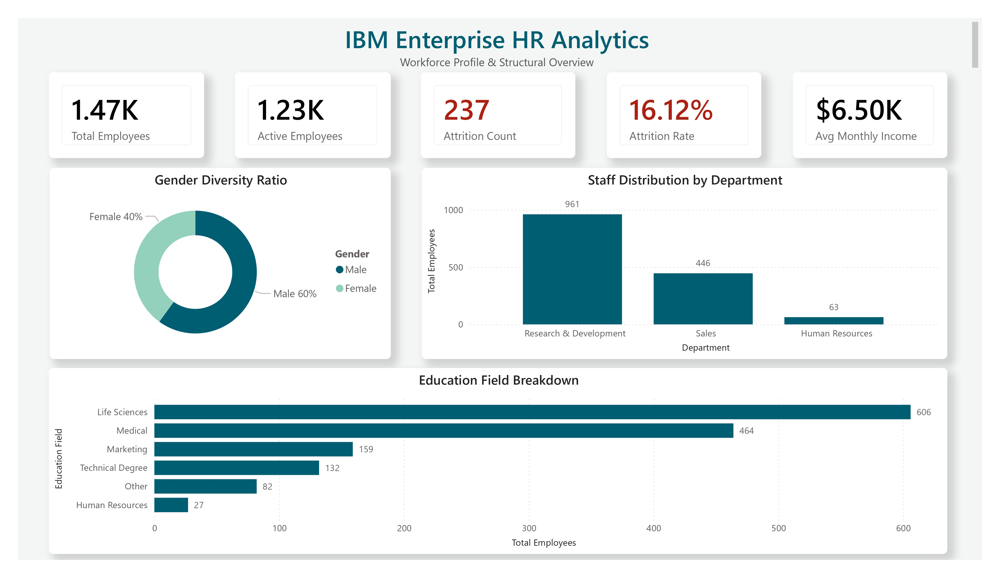
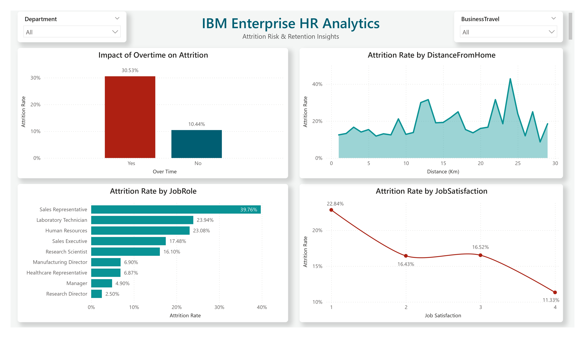

# IBM HR Analytics Employee Attrition Dashboard

## Dashboard Preview

### Workforce Overview



### Attrition and Risk Analysis



## Project Overview

This project delivers an end-to-end Business Intelligence solution designed to diagnose, analyze, and mitigate voluntary workforce turnover. By utilizing **SQL (MySQL)** for data engineering and **Power BI** for star-schema dimensional modeling and interactive visualization, this project translates raw HR data into strategic talent retention insights.

## Business Problem

HR teams need to understand why employees leave and which groups are at risk. This project answers:

- What is the overall attrition rate?
- Which departments have the highest attrition?
- How does overtime affect attrition?
- Which job roles are most vulnerable?
- How does job satisfaction relate to attrition?
- Which groups need retention attention?

## Dataset

The dataset contains 1,470 employee records and 35 columns.

Key fields:

- Age
- Attrition
- Business Travel
- Department
- Distance From Home
- Education
- Gender
- Job Role
- Job Satisfaction
- Monthly Income
- Overtime
- Performance Rating
- Work Life Balance
- Years At Company

## Tools Used

- MySQL Workbench
- SQL
- Power BI Desktop
- Power Query
- DAX
- Data Modeling

## SQL Workflow

1. Created HR analytics database.
2. Loaded employee records into a raw table.
3. Removed constant columns.
4. Explored attrition by department and overtime.
5. Created star-schema views:
   - `vw_dim_demographics`
   - `vw_dim_job_details`
   - `vw_fact_employee_performance`

## Dashboard Pages

- Workforce Overview
- Attrition and Risk Analysis

## Key Business Insights & Actionable Recommendations

* **Baseline Attrition:** The organization faces an overall voluntary turnover rate of **16.12%**.
* **The Overtime Burnout Factor:** Overtime drives a massive surge in turnover—**30.53%** attrition for overtime workers vs. **10.44%** for non-overtime peers.
    *BA Recommendation:* Partner with department heads to deploy an automated workload audit trigger whenever a team's continuous overtime logs breach acceptable thresholds.
* **High-Turnover Job Roles:** Turnover heavily clusters in frontline operational roles, led by **Sales Representatives (39.76%)** and **Laboratory Technicians (23.94%)**.
    *BA Recommendation:* Launch targeted qualitative stay-interviews in the Sales and R&D divisions to optimize compensation tiers and establish clearer career-pathing frameworks.
* **Satisfaction Inverse Correlation:** Data confirms a strict linear drop in attrition as qualitative job satisfaction scores improve from scale 1 to 4.
    *BA Recommendation:* Introduce automated pulse survey triggers to identify localized drops in satisfaction metrics before they turn into voluntary exits.

## Repository Structure

```text
ibm-hr-attrition-analytics-dashboard/
├── 01_data/
│   └── raw/
│       └── WA_Fn-UseC_-HR-Employee-Attrition.csv   # Raw IBM Source Dataset
├── 02_sql_scripts/
│   ├── 01_database_setup.sql                    # Database and Table Initialization
│   ├── 02_data_cleaning.sql                      # ETL Layer: Dropping Constants
│   ├── 03_data_exploration.sql                   # Ad-hoc Exploratory Queries
│   └── 04_star_schema_views.sql                  # Star Schema Views Generation
├── 03_powerbi/
│   └── HR_Attrition_Dashboard.pbix               # Compiled Power BI Semantic Layer
├── 04_docs/
│   └── data_dictionary.md                        # Column Metadata and Data Dictionary
└── 05_screenshots/
    ├── 01_workforce_overview.jpg                 # Executive KPI Dashboard Screen
    └── 02_attrition_risk_analysis.jpg            # Deep-dive Risk Analytics Matrix
```

## Skills Demonstrated

- HR Analytics
- SQL Data Exploration
- Star Schema Modeling
- Power BI Dashboarding
- DAX Measures
- Workforce Risk Analysis

## Future Improvements

- Find employees with higher chances of leaving.
- Compare attrition across different tenure groups.
- Add simple retention suggestions for HR teams.
- Share the dashboard through Power BI Service.

